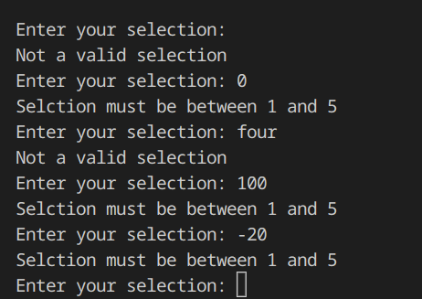
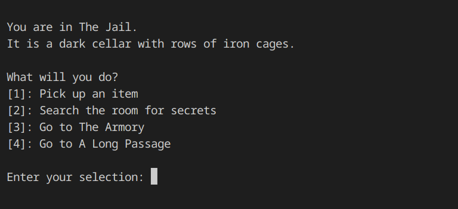
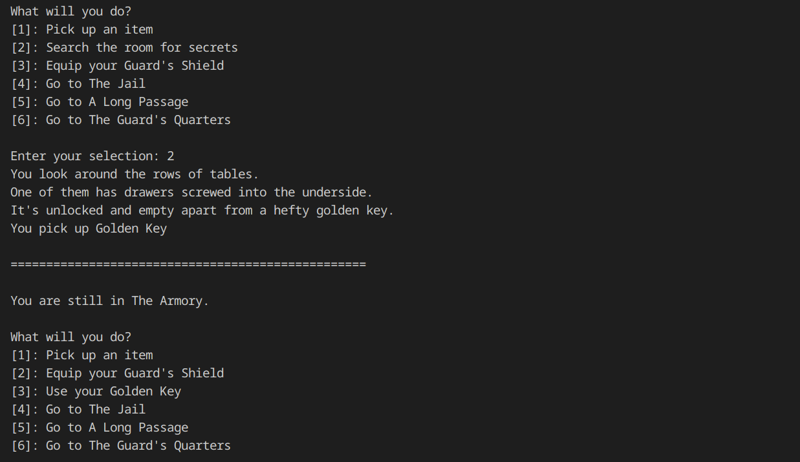
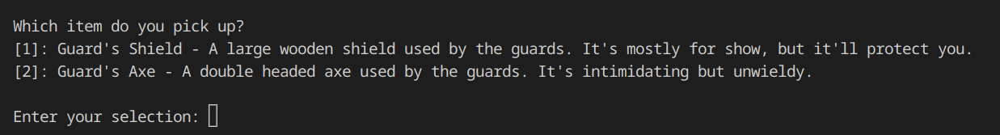
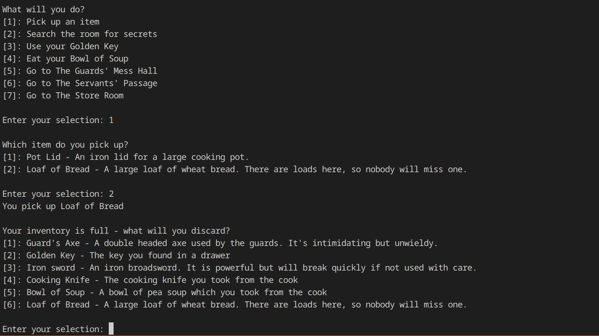
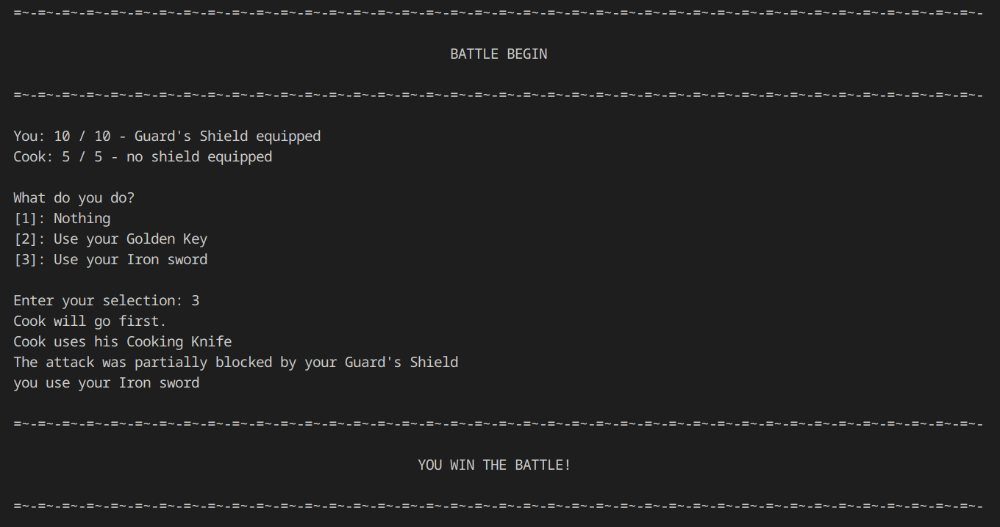

# Testing

## Menus
Menus use numerical inputs, which are validated before being used.

## Menus in rooms
Menus in rooms should only show actions appropriate to the room and the player's inventory.\
In this case the player's inventory is empty so no item prompts are shown.

The menu can change while the player is in a room, for instance the 'search for secrets' option is removed after the player selects it, and 'use your item' messages appear as soon as the player gets the item

## Item pickup menus
Item pickup menus show the descriptions of items which the player has picked up, and don't allow the player to exceed the maximum inventory size.

## Battles
Each NPC has a health and an inventory of predetermined items. The enemy AI will prioritise defence over attack, but some defence items are designed mainly for the player to pick up after a battle.
